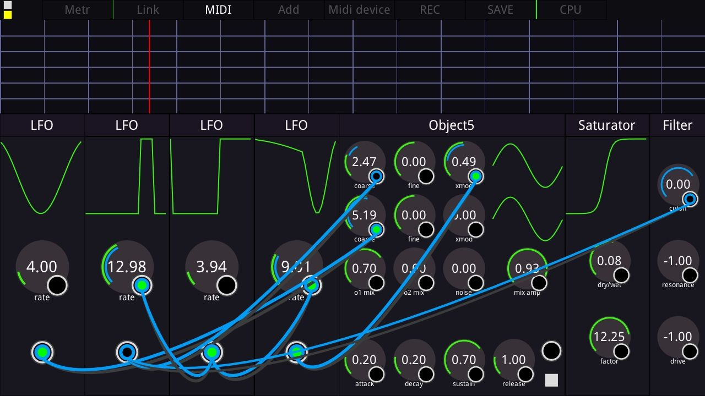

PocketDaw
================================================================================================



# Prerequisites

**Remark**: Although those build instructions assume a linux platform to generate the APKs, the used tools are available for OSX and MSWindows. As a result, the specified commands should be easily adapted to work for those platforms.

## Android Studio

This project uses [Android Studio](http://developer.android.com/sdk/index.html) build system, Gradle, to generate Android's APK files, so you need to download it and install it properly. Android Studio comes with Android SDK, so no need to install it separatly.

*Following commands assume it was installed to `~/android/android-studio` directory.*

## Android NDK

[Android NDK](http://developer.android.com/ndk/downloads/index.html) is required to compile bgfx for android platforms. You can install it using Android Studio's SDK Manager. 

*Following commands assume it was installed to `~/android/sdk/ndk-bundle` directory.*

## Environment variables (only for Linux)

```shell
sudo nano /etc/profile.d/ndk.sh
```
Add the following lines:
```shell
export ANDROID_NDK_ROOT=~/android/sdk/ndk-bundle
export ANDROID_NDK_CLANG=$ANDROID_NDK_ROOT/toolchains/llvm/prebuilt/linux-x86_64
export ANDROID_NDK_ARM=$ANDROID_NDK_ROOT/toolchains/arm-linux-androideabi-4.9/prebuilt/linux-x86_64
export ANDROID_NDK_X86=$ANDROID_NDK_ROOT/toolchains/x86-4.9/prebuilt/linux-x86_64
```
*Note: Historically the NDK supported 32-bit and 64-bit MIPS (and so does `bgfx`), but support was removed in NDK r17.*

You can also extend the `PATH` variable to be able to access Android platform tools (`adb`, `dmtracedump`, etc) from the shell:
```shell
export ANDROID_SDK_ROOT=~/android/sdk
export PATH=$PATH:$ANDROID_SDK_ROOT/platform-tools
```

You may need to reboot in order to reload those environment variables.

# Setup project

## Clone repositories

```shell
git clone --recurse-submodules https://github.com/ferluht/pd.git
```

# Build APK

## Packaging

Launch android studio, and import the project. Select `Build` menu, and generate APK using `Make Project` entry.

*Note: If you change the build variant to release, you'll need to sign your APK before deployment, this is off this tutorial's scope*

To deploy to your target device, go to the `Run` menu and either choose `Run 'app'` or `Debug 'app'` entry.

*Note: Generated APKs goes to `pocketdaw/app/build/outputs/apk` directory*

## Acknowledgements

Graphical subsystem is based on bgfx render api
